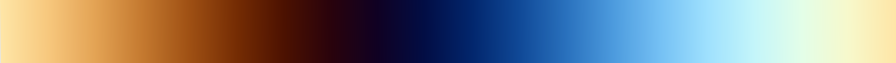
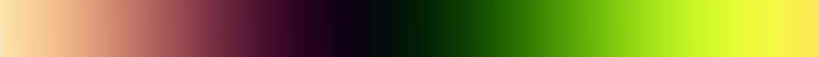
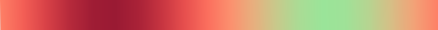

<!-- omit in toc -->
# Color Palette Configurator HDA

> [← Back to features](./README.md)

The Color Palette Configurator makes it easy to customize Houdini's node colors. I created this tool to make network organization more flexible and visually appealing.

<!-- omit in toc -->
## Table of Contents
- [Overview](#overview)
- [Getting Started](#getting-started)
- [Features](#features)
  - [Main Color List](#main-color-list)
  - [Gradient Generator](#gradient-generator)
    - [Step 1: Creating Gradients](#step-1-creating-gradients)
    - [Example Cosine Parameter Effects](#example-cosine-parameter-effects)
    - [Built-in Presets](#built-in-presets)
    - [Step 2: Using Gradient Samples](#step-2-using-gradient-samples)
  - [Text-Based Colors](#text-based-colors)
  - [Exporting Colors](#exporting-colors)
    - [Sharing Palettes](#sharing-palettes)
- [Troubleshooting](#troubleshooting)
  - [Colors Not Updating](#colors-not-updating)
  - [Colors Look Different](#colors-look-different)
  - [Need Help?](#need-help)

## Overview

By default, Houdini gives you 36 colors in the network palette. This tool lets you:
- Modify these colors
- Create new color schemes
- Generate color gradients
- Import and export palettes

## Getting Started

1. Find the tool in: OBJ/SOP Tab Menu → Node Weaver → Color Palette Configurator
2. The interface shows:
   - Location of default Houdini color palette file
   - Import/export options
   - Main colors list tab
   - Gradient generator control tab
   - Text-based palette tab

## Features

### Main Color List

The main colors list determines what gets imported from files or exported to them:
- Click any color to edit
- Colors appear in the network view color picker (C key) in order, left to right, top to bottom
- The "Color Palette File" parameter controls:
  - Where colors save when using "Save Colors to File"
  - Where colors load from when using "Populate Colors from File"
  - Default location matches Houdini's manual color palette save location

### Gradient Generator

#### Step 1: Creating Gradients

There are three ways to generate gradients:

1. **Manual Entry**
   - Set values directly as you would in other Houdini gradients

2. **Screen Sampling**
   - Click and drag anywhere on screen to sample colors
   - Useful for sampling from images or satellite map data

3. **Cosine Formula** (credit: [Inigo Quilez](https://iquilezles.org/articles/palettes/))
   - Creates smooth, pleasing gradients
   - Parameters:
     - Brightness, Contrast, Frequency, and Offset
     - Each has R, G, and B values
     - Parameters control how each color channel cycles through the cosine wave

#### Example Cosine Parameter Effects
Examples using only the Red channel:

- Brightness 0.5, Contrast 0.5, Frequency 1, Offset 0:
  

- Brightness 0.5, Contrast 1, Frequency 2, Offset 0:
  

- Brightness 0, Contrast 0.25, Frequency 1.5, Offset -0.25:
  

#### Built-in Presets

The tool includes several presets:

- Infrared
  

- Earth/Ice
  

- Aqua, Black, Red, White, Aqua
  

- Flower Blossom
  

- Cosmic
  

- Neon
  

- Peach, Crimson, Peach, Aqua, Peach
  

- Watermelon
  

- Blueberry
  

#### Step 2: Using Gradient Samples

To add gradient colors to your palette:

1. Set "Number of Samples" and click "Create Samples From Gradient"
2. Review generated colors in the multiparm below
   - Colors aren't added to Main Color List yet
   - Adjust, remove, or add colors as needed
3. Click "Add Gradient Samples to Main Color List"
   - "Delete From Here After": Clears samples after adding
   - "Add to Top": Places colors at start of list instead of end

### Text-Based Colors

Import colors from:
- Hex codes
- Adobe Color CSS format (from color.adobe.com)

Options:
- Add directly to Main Color List
- Generate gradient from colors (evenly spaced)

### Exporting Colors

- **Save Colors to File**: Saves to the location specified in "Color Palette File" parameter
  - Must end in `/config/opColorPalette.def`
  - Must save in either:
    - Houdini preferences folder (default)
    - Custom Houdini tools folder
  - Palette update takes effect after Houdini restart

#### Sharing Palettes
- If you want to share your palette with anyone, give them the `opColorPalette.def` file.
- Same file location requirements apply if the colors are to appear in their Houdini installation.
- If you want to package an `opColorPalette.def` file in your own package, put it in an optional folder in case your users already have a color palette they want to keep.

## Troubleshooting

### Colors Not Updating

**File Location Issues:**
- File must be named `opColorPalette.def`
- Must be in a `/config` folder
- Base folder must be in either:
  - Houdini preferences folder (default)
  - Custom Houdini tools folder

Example paths:
```
Windows: C:/Users/YourUsername/Documents/HoudiniTools/NodeWeaver/config/opColorPalette.def
Mac: /Users/YourUsername/Documents/HoudiniTools/NodeWeaver/config/opColorPalette.def
Linux: /home/YourUsername/HoudiniTools/NodeWeaver/config/opColorPalette.def
```

**Multiple Files:**
- Having `opColorPalette.def` in external packages overrides preferences folder
- Either update external file or delete it

**After Changes:**
- Restart Houdini to rescan folders

### Colors Look Different
- In Color Editor window, disable "Enable Color Correction" in top bar (looks like greyscale ramp)

### Need Help?
If you run into issues:
1. Check if restarting Houdini helps
2. Look through [existing issues](https://github.com/EJaworenko/Node-Weaver/issues)
3. [Open a new issue](https://github.com/EJaworenko/Node-Weaver/issues/new)